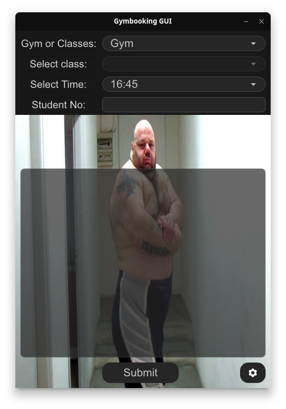

# tzimpouki
Automated gym booking in Rust.

# Important Note
Before installing it is mandatory to follow the One, a.k.a. [Kyriakos Grizzly](https://www.instagram.com/kapakoulak). Trust me, he will know if you don't and you don't want that! Ask the single mother of four!

# Install
The program is written in Rust. To install clone the project and install via cargo, i.e
## CLI
```bash
git clone git@github.com:konmenel/gymbooking
cd gymbooking
cargo install --path .
```

## GUI
```bash
git clone git@github.com:konmenel/gymbooking
cd gymbooking
cargo install --path . --features gui --bin gymbooking-gui
```

# Running
Run the program using the following command for your student number and desired time 
```bash
gymbooking --id <student-number> --time <HH:MM>
```
or
```bash
gymbooking-gui
```


# Disclaimer
This program and the author do not guarantee any gym gains. If you experience loss of strength and/or muscle mass,
consult your doctor. You are most likely not eating enough protein and/or calories. 


# Screenshots


